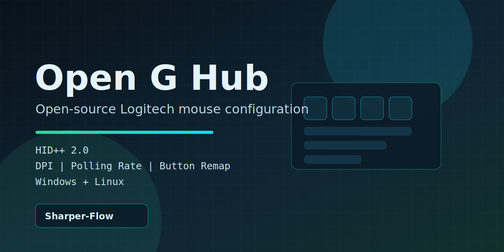

<p align="center">
  
</p>

<p align="center">
  <a href="https://github.com/Sharper-Flow/Open-G-Hub/actions/workflows/ci.yml">
    
  </a>
  <a href="https://github.com/Sharper-Flow/Open-G-Hub/blob/main/LICENSE">
    
  </a>
  <a href="https://github.com/Sharper-Flow/Open-G-Hub/actions/workflows/codeql.yml">
    
  </a>
  
  
  
</p>

<h1 align="center">Open G Hub</h1>

<p align="center">
  Open-source replacement for Logitech G Hub mouse configuration.<br/>
  Direct HID++ 2.0 control, local-first, and no telemetry.
</p>

## Why this project exists

`Open G Hub` focuses on practical mouse configuration without a heavyweight companion app. It communicates with Logitech devices over USB HID using HID++ 2.0 and exposes both CLI and GUI workflows.

## Current status

- Device focus: `Logitech G502 Lightspeed` and `G502 HERO`
- Core functionality: DPI, polling rate, button remapping, onboard profile controls
- Build targets: Linux + Windows
- Safety model: bounds checks and explicit HID++ feature whitelist
- Storage policy: legacy `open-g-hub/profile.json` is removed; persistence targets Logitech G Hub storage contract

## Features

- DPI configuration (`100-25,600`, step `50`) via `ADJUSTABLE_DPI (0x2201)`
- Polling rate control (`125/250/500/1000 Hz`) via `REPORT_RATE (0x8060)`
- Button remapping (`6` programmable buttons) via `REPROG_CONTROLS_V4 (0x1B04)`
- Onboard profile mode/control via `ONBOARD_PROFILES (0x8100)`
- Structured diagnostics with `tracing` and `RUST_LOG`

## Supported devices

| Device | VID | PID | Status |
|--------|-----|-----|--------|
| G502 Lightspeed | `0x046D` | `0xC08D` | Supported |
| G502 HERO | `0x046D` | `0xC08B` | Supported |

## Quick start

```bash
git clone https://github.com/Sharper-Flow/Open-G-Hub.git
cd Open-G-Hub
cargo build --release

# CLI
./target/release/open-g-hub-cli --help

# GUI
./target/release/open-g-hub-gui
```

## Windows one-file portable executable

You can run Open G Hub on Windows as a single portable `.exe` (no installer required):

- Download artifact: `Open-G-Hub-Windows-Portable.exe` from GitHub Actions artifacts/releases
- Run directly

For local build on Windows:

```powershell
scripts\build-windows-portable.ps1
```

Output:

- `dist\Open-G-Hub-Windows-Portable.exe`

## Windows setup (Zadig / WinUSB)

Windows typically blocks direct HID access with the default mouse driver stack, so a one-time WinUSB setup is required.

Trust and source references:
- Official Zadig website: [zadig.akeo.ie](https://zadig.akeo.ie/)
- Zadig source code: [github.com/pbatard/zadig](https://github.com/pbatard/zadig)
- libwdi (driver backend): [github.com/pbatard/libwdi](https://github.com/pbatard/libwdi)

Quick setup (Windows batch launcher, run as Administrator):

```bat
scripts\install-winusb-driver.bat
```

Or directly via PowerShell:

```powershell
.\scripts\install-winusb-driver.ps1
```

Manual fallback and recovery instructions are in `TROUBLESHOOTING.md`.

## CLI usage

```bash
open-g-hub-cli list-devices
open-g-hub-cli get-dpi
open-g-hub-cli set-dpi 1600
open-g-hub-cli get-rate
open-g-hub-cli set-rate 1000
open-g-hub-cli get-buttons
open-g-hub-cli set-button 0 right
```

## Project layout

```text
open-g-hub/
  crates/
    core/  # HID++ protocol, transport, safety, persistence layer
    gui/   # iced desktop app
    cli/   # clap command-line app
  assets/
  docs/
  scripts/
```

More detail: `ARCHITECTURE.md`

## Development

```bash
cargo test
cargo clippy -- -D warnings
cargo fmt --all -- --check
cargo llvm-cov -p open-g-hub-core --fail-under-lines 90 --summary-only
```

For tracing:

```bash
RUST_LOG=trace cargo run -p open-g-hub-cli -- list-devices
```

## Documentation

- `ARCHITECTURE.md`
- `CONTRIBUTING.md`
- `SECURITY.md`
- `TROUBLESHOOTING.md`
- `docs/PACKAGING.md`

## License

MIT. Protocol research references include libratbag (MIT) and Solaar (GPLv2).
